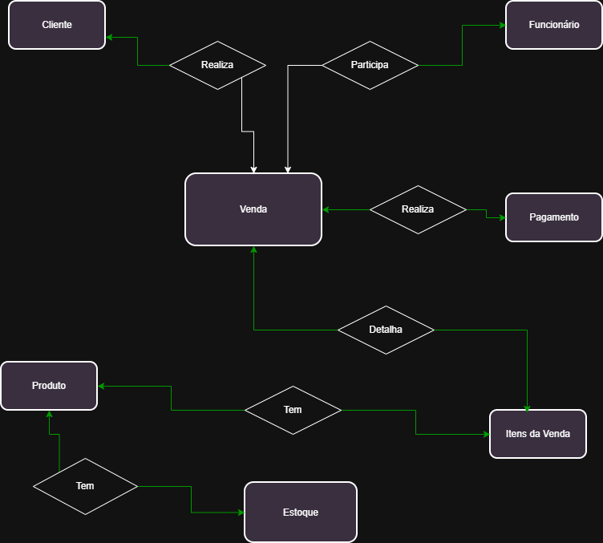
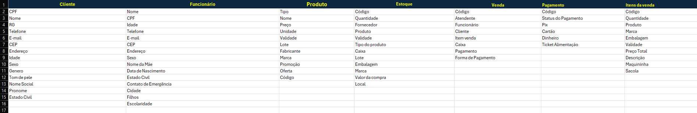
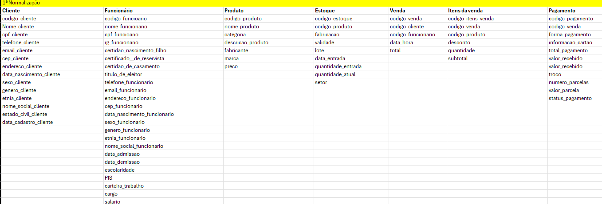
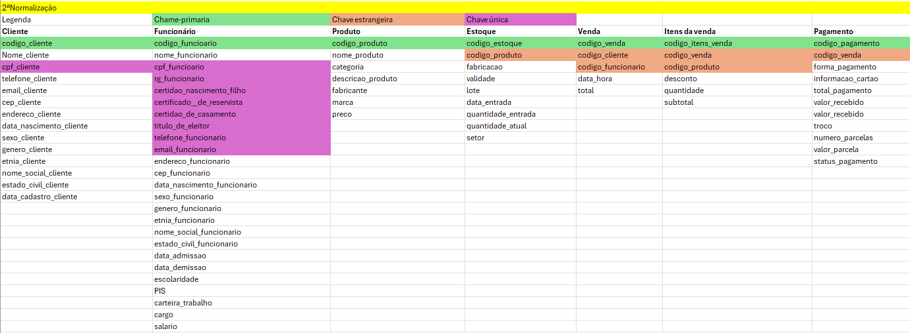
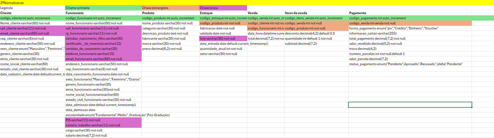
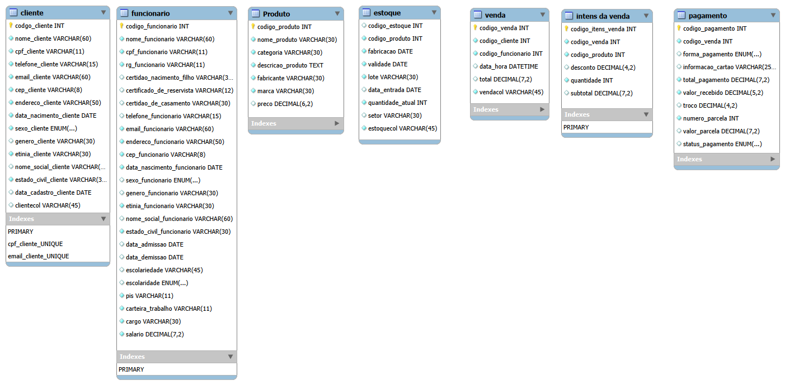
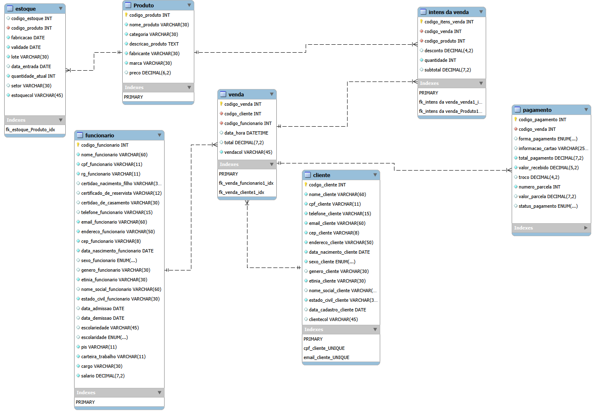

# Estudo de caso
## Casa Oliveira

    Roberto é dono de um mercado no bairro de Vargem Grande, na cidade de Tupã. 
    Ele herdou o negócio de seu pai, Gumercindo Oliveira. O negócio iniciou em 1978 
    na garagem da casa da família, era uma pequena quitanda. Com o passar dos 
    anos, o negócio cresceu, e Gumercindo mudou-se para um local maior, onde 
    permaneceu até os dias atuais. 
    Roberto, o novo dono do mercado, continuou o negócio da mesma forma que o 
    pai. Ele comprava grandes volumes de produtos diretamente com os fornecedores 
    e os armazenava em seu estoque. Às vezes, ele comprava muitos produtos 
    mesmo já tendo estoque, o que causava uma sobrecarga. Além disso, tinha 
    muitos produtos estragados, tais como: frutas, legumes, iogurtes, leites, frango, 
    etc. Também havia muitos produtos com o prazo de validade vencido. 
    Os funcionários eram poucos e faziam muitas coisas ao mesmo tempo. O 
    açougueiro também ajudava no estoque; a moça da limpeza ajudava na 
    organização dos produtos das prateleiras, além de auxiliar na padaria. Quando o 
    caixa estava vazio, o operador ajudava a repor os laticínios e a limpar a loja. O 
    repositor também trabalhava no caixa. 
    Ao realizar a venda, Roberto, que sabia o nome de quase todos os clientes, 
    anotava em um caderno todos os produtos vendidos e o que havia em estoque. Ao 
    fim do dia, ele pegava o caderno e fazia os cálculos de quanto havia vendido, 
    somando o faturamento e atualizando o estoque. Esse processo é feito todos os 
    dias e toma um tempo considerável para ser concluído. 
    Roberto fechava a loja às 18h, mas só ia para casa às 22h, após fazer todas as 
    operações necessárias. Mesmo assim, o negócio vai bem, e Roberto pretende 
    mudar-se para outro ponto, aumentar o volume de negócios e contratar novos 
    funcionários. 
    Márcia, esposa de Roberto, vem conversando com ele há muito tempo para que 
    contrate uma empresa para construir um sistema de informática para gerenciar o 
    negócio. O objetivo é reduzir o tempo que ele passa trabalhando, obter melhor 
    organização dos produtos, maior lucratividade e melhorar a gestão. 
    Com a intenção de aumentar o negócio, Roberto está disposto a informatizar sua 
    empresa. Vamos ajudá-lo. Começaremos construindo o banco de dados

## Modelo Conceitual

<p align="center">
    
</p>

## Normalizações
<p align="center">
    
</p>


### 1ª Normalizacao
<p align="center">
    

### 2ª Normalização
<p align="center">
    
</p>

### 3ª Normalização
<p align="center">
    
</p>

## Modelo Lógico

### Diagrama do Modelo Lógico
<p align="center">
    
</p>

### Modelo de Entidade Relacional - Modelo Lógico
<p align="center">
    
</p>

## Modelo Físico

``` sql


-- MySQL Script generated by MySQL Workbench
-- Mon Jun 29 11:56:44 2026
-- Model: New Model    Version: 1.0
-- MySQL Workbench Forward Engineering

SET @OLD_UNIQUE_CHECKS=@@UNIQUE_CHECKS, UNIQUE_CHECKS=0;
SET @OLD_FOREIGN_KEY_CHECKS=@@FOREIGN_KEY_CHECKS, FOREIGN_KEY_CHECKS=0;
SET @OLD_SQL_MODE=@@SQL_MODE, SQL_MODE='ONLY_FULL_GROUP_BY,STRICT_TRANS_TABLES,NO_ZERO_IN_DATE,NO_ZERO_DATE,ERROR_FOR_DIVISION_BY_ZERO,NO_ENGINE_SUBSTITUTION';

-- -----------------------------------------------------
-- Schema casaoliveiradb
-- -----------------------------------------------------

-- -----------------------------------------------------
-- Schema casaoliveiradb
-- -----------------------------------------------------
CREATE SCHEMA IF NOT EXISTS `casaoliveiradb` DEFAULT CHARACTER SET utf8 ;
USE `casaoliveiradb` ;

-- -----------------------------------------------------
-- Table `casaoliveiradb`.`cliente`
-- -----------------------------------------------------
CREATE TABLE IF NOT EXISTS `casaoliveiradb`.`cliente` (
  `codigo_cliente` INT NOT NULL AUTO_INCREMENT,
  `nome_cliente` VARCHAR(60) NOT NULL,
  `cpf_cliente` VARCHAR(11) NOT NULL,
  `telefone_cliente` VARCHAR(15) NOT NULL,
  `email_cliente` VARCHAR(60) NOT NULL,
  `cep_cliente` VARCHAR(8) NOT NULL,
  `endereco_cliente` VARCHAR(50) NULL,
  `data_nascimento_cliente` DATE NOT NULL,
  `sexo_cliente` ENUM("Masculino", "Feminino", "Outros") NULL,
  `genero_cliente` VARCHAR(30) NULL,
  `etnia_cliente` VARCHAR(30) NOT NULL,
  `nome_social_cliente` VARCHAR(60) NULL,
  `estado_civil_cliente` VARCHAR(30) NOT NULL,
  `data_cadastro_cliente` DATE NULL DEFAULT current_timestamp(),
  PRIMARY KEY (`codigo_cliente`),
  UNIQUE INDEX `cpf_cliente_UNIQUE` (`cpf_cliente` ASC) VISIBLE,
  UNIQUE INDEX `email_cliente_UNIQUE` (`email_cliente` ASC) VISIBLE)
ENGINE = InnoDB;


-- -----------------------------------------------------
-- Table `casaoliveiradb`.`produto`
-- -----------------------------------------------------
CREATE TABLE IF NOT EXISTS `casaoliveiradb`.`produto` (
  `codigo_produto` INT NOT NULL AUTO_INCREMENT,
  `nome_produto` VARCHAR(30) NOT NULL,
  `categoria_produto` VARCHAR(30) NOT NULL,
  `descricao_produto` TEXT NOT NULL,
  `fabricante_produto` VARCHAR(30) NOT NULL,
  `marca_produto` VARCHAR(30) NOT NULL,
  `preco_produto` DECIMAL(6,2) NOT NULL,
  PRIMARY KEY (`codigo_produto`))
ENGINE = InnoDB;


-- -----------------------------------------------------
-- Table `casaoliveiradb`.`funcionario`
-- -----------------------------------------------------
CREATE TABLE IF NOT EXISTS `casaoliveiradb`.`funcionario` (
  `codigo_funcionario` INT NOT NULL AUTO_INCREMENT,
  `nome_funcionario` VARCHAR(60) NOT NULL,
  `cpf_funcionario` VARCHAR(11) NOT NULL,
  `rg_funcionario` VARCHAR(11) NOT NULL,
  `certidao_nascimento_funcionario` VARCHAR(30) NULL,
  `certificado_reservista_funcionario` VARCHAR(12) NULL,
  `certidao_casamento_funcionario` VARCHAR(30) NULL,
  `titulo_eleitor_funcionario` VARCHAR(11) NULL,
  `telefone_funcionario` VARCHAR(15) NULL,
  `email_funcionario` VARCHAR(60) NOT NULL,
  `cep_funcionario` VARCHAR(8) NOT NULL,
  `endereco_funcionario` VARCHAR(60) NOT NULL,
  `data_nascimento_funcionario` DATE NOT NULL,
  `sexo_funcionario` ENUM("Masculino", "Feminino", "Outros") NULL,
  `genero_funcionario` VARCHAR(30) NULL,
  `etnia_funcionario` VARCHAR(30) NOT NULL,
  `nome_social_funcionario` VARCHAR(60) NULL,
  `estado_civil_funcionario` VARCHAR(30) NOT NULL,
  `data_admissao_funcionario` DATE NULL DEFAULT current_timestamp(),
  `data_demissao_funcionario` DATE NULL,
  `escolaridade_funcionario` ENUM("Fundamental", "Medio", "Graduacao", "Pos-Graduacao") NULL,
  `pis_funcionario` VARCHAR(11) NOT NULL,
  `carteira_trabalho_funcionario` VARCHAR(11) NOT NULL,
  `cargo_funcionario` VARCHAR(30) NOT NULL,
  `salario_funcionario` DECIMAL(7,2) NOT NULL,
  PRIMARY KEY (`codigo_funcionario`),
  UNIQUE INDEX `rg_funcionario_UNIQUE` (`rg_funcionario` ASC) VISIBLE,
  UNIQUE INDEX `cpf_funcionario_UNIQUE` (`cpf_funcionario` ASC) VISIBLE,
  UNIQUE INDEX `certidao_nascimento_funcionario_UNIQUE` (`certidao_nascimento_funcionario` ASC) VISIBLE,
  UNIQUE INDEX `certificado_reservista_funcionario_UNIQUE` (`certificado_reservista_funcionario` ASC) VISIBLE,
  UNIQUE INDEX `certidao_casamento_funcionario_UNIQUE` (`certidao_casamento_funcionario` ASC) VISIBLE,
  UNIQUE INDEX `funcionariocol_UNIQUE` (`titulo_eleitor_funcionario` ASC) VISIBLE,
  UNIQUE INDEX `telefone_funcionario_UNIQUE` (`telefone_funcionario` ASC) VISIBLE,
  UNIQUE INDEX `email_funcionario_UNIQUE` (`email_funcionario` ASC) VISIBLE,
  UNIQUE INDEX `pis_funcionario_UNIQUE` (`pis_funcionario` ASC) VISIBLE,
  UNIQUE INDEX `funcionariocol_UNIQUE` (`carteira_trabalho_funcionario` ASC) VISIBLE)
ENGINE = InnoDB;


-- -----------------------------------------------------
-- Table `casaoliveiradb`.`estoque`
-- -----------------------------------------------------
CREATE TABLE IF NOT EXISTS `casaoliveiradb`.`estoque` (
  `codigo_estoque` INT NOT NULL AUTO_INCREMENT,
  `codigo_produto` INT NOT NULL,
  `fabricacao_produto` DATE NOT NULL,
  `validade_produto` DATE NOT NULL,
  `lote_produto` VARCHAR(30) NOT NULL,
  `data_entrada_produto` DATE NULL DEFAULT default current_timestamp,
  `quantidade_entrada_produto` INT NOT NULL DEFAULT 1,
  `quantidade_atual_produto` INT NOT NULL,
  `setor_produto` VARCHAR(30) NOT NULL,
  PRIMARY KEY (`codigo_estoque`),
  UNIQUE INDEX `lote_produto_UNIQUE` (`lote_produto` ASC) VISIBLE,
  INDEX `fk_estoque_produto_idx` (`codigo_produto` ASC) VISIBLE,
  CONSTRAINT `fk_estoque_produto`
    FOREIGN KEY (`codigo_produto`)
    REFERENCES `casaoliveiradb`.`produto` (`codigo_produto`)
    ON DELETE NO ACTION
    ON UPDATE NO ACTION)
ENGINE = InnoDB;


-- -----------------------------------------------------
-- Table `casaoliveiradb`.`Venda`
-- -----------------------------------------------------
CREATE TABLE IF NOT EXISTS `casaoliveiradb`.`Venda` (
  `codigo_venda` INT NULL AUTO_INCREMENT,
  `codigo_cliente` INT NOT NULL,
  `codigo_funcionario` INT NOT NULL,
  `data_hora_venda` DATETIME NULL DEFAULT default current_timestamp(),
  `total_venda` DECIMAL(7,2) NOT NULL,
  PRIMARY KEY (`codigo_venda`),
  INDEX `fk_Venda_funcionario1_idx` (`codigo_funcionario` ASC) VISIBLE,
  INDEX `fk_Venda_cliente1_idx` (`codigo_cliente` ASC) VISIBLE,
  CONSTRAINT `fk_Venda_funcionario1`
    FOREIGN KEY (`codigo_funcionario`)
    REFERENCES `casaoliveiradb`.`funcionario` (`codigo_funcionario`)
    ON DELETE NO ACTION
    ON UPDATE NO ACTION,
  CONSTRAINT `fk_Venda_cliente1`
    FOREIGN KEY (`codigo_cliente`)
    REFERENCES `casaoliveiradb`.`cliente` (`codigo_cliente`)
    ON DELETE NO ACTION
    ON UPDATE NO ACTION)
ENGINE = InnoDB;


-- -----------------------------------------------------
-- Table `casaoliveiradb`.`Itens da Venda`
-- -----------------------------------------------------
CREATE TABLE IF NOT EXISTS `casaoliveiradb`.`Itens da Venda` (
  `codigo_itens_venda` INT NULL AUTO_INCREMENT,
  `codigo_venda` INT NOT NULL,
  `codigo_produto` INT NOT NULL,
  `desconto_venda` DECIMAL(4,2) NULL DEFAULT 0.0,
  `quantidade` INT NOT NULL DEFAULT 1,
  `subtotal` DECIMAL(7,2) NULL,
  PRIMARY KEY (`codigo_itens_venda`),
  INDEX `fk_Itens da Venda_Venda1_idx` (`codigo_venda` ASC) VISIBLE,
  INDEX `fk_Itens da Venda_produto1_idx` (`codigo_produto` ASC) VISIBLE,
  CONSTRAINT `fk_Itens da Venda_Venda1`
    FOREIGN KEY (`codigo_venda`)
    REFERENCES `casaoliveiradb`.`Venda` (`codigo_venda`)
    ON DELETE NO ACTION
    ON UPDATE NO ACTION,
  CONSTRAINT `fk_Itens da Venda_produto1`
    FOREIGN KEY (`codigo_produto`)
    REFERENCES `casaoliveiradb`.`produto` (`codigo_produto`)
    ON DELETE NO ACTION
    ON UPDATE NO ACTION)
ENGINE = InnoDB;


-- -----------------------------------------------------
-- Table `casaoliveiradb`.`Pagamento`
-- -----------------------------------------------------
CREATE TABLE IF NOT EXISTS `casaoliveiradb`.`Pagamento` (
  `codigo_pagamento` INT NOT NULL AUTO_INCREMENT,
  `codigo_venda` INT NOT NULL,
  `forma_pagamento` ENUM("Pix", "Débito", "Crédito", "Dinheiro", "Voucher") NOT NULL,
  `informacao_cartao` VARCHAR(255) NULL,
  `total_pagamento` DECIMAL(7,2) NOT NULL,
  `valor_recebido` DECIMAL(5,2) NOT NULL,
  `troco` DECIMAL(4,2) NULL,
  `numero_parcelas` INT NOT NULL DEFAULT 1,
  `valor_parcela` DECIMAL(7,2) NULL,
  `status_pagamento` ENUM("Pendente", "Aprovado", "Recusado") NULL DEFAULT 'defautl \"Pendente\"',
  PRIMARY KEY (`codigo_pagamento`),
  INDEX `fk_Pagamento_Venda1_idx` (`codigo_venda` ASC) VISIBLE,
  CONSTRAINT `fk_Pagamento_Venda1`
    FOREIGN KEY (`codigo_venda`)
    REFERENCES `casaoliveiradb`.`Venda` (`codigo_venda`)
    ON DELETE NO ACTION
    ON UPDATE NO ACTION)
ENGINE = InnoDB;


SET SQL_MODE=@OLD_SQL_MODE;
SET FOREIGN_KEY_CHECKS=@OLD_FOREIGN_KEY_CHECKS;
SET UNIQUE_CHECKS=@OLD_UNIQUE_CHECKS;


```